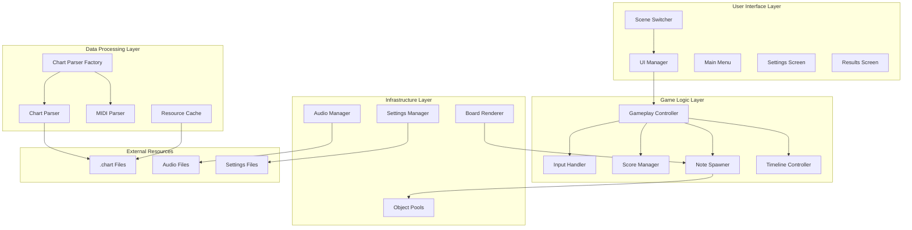
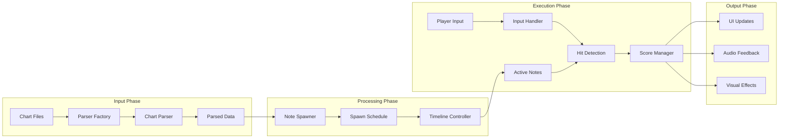
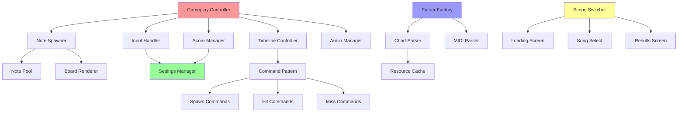
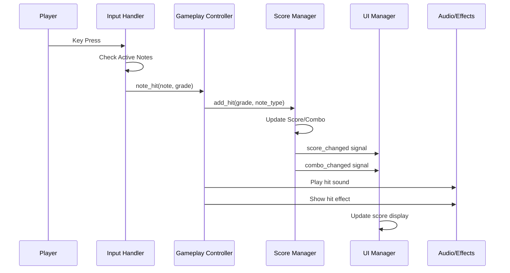
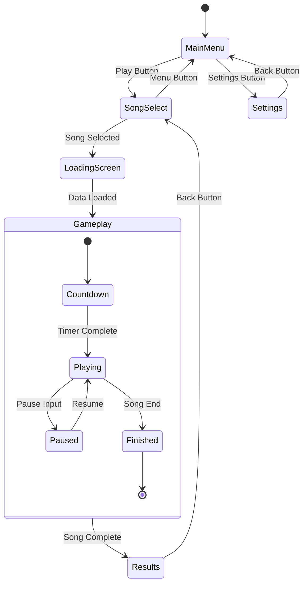
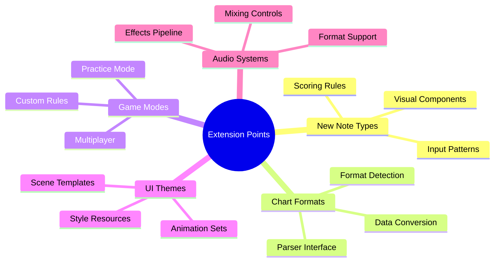
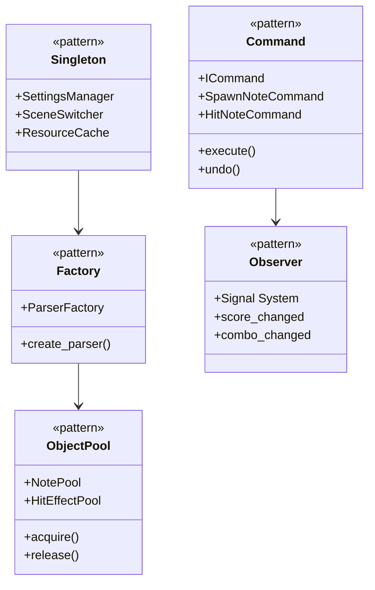

# High-Level Architecture Diagrams

**Version:** 1.0  
**Date:** October 13, 2025  
**Project:** Godot 4 3D Rhythm Game

---

## System Architecture Overview



---

## Data Flow Architecture



---

## Component Dependencies



---

## Signal Flow Diagram



---

## State Management Architecture



---

## Performance Architecture

```mermaid
graph LR
    subgraph "Memory Management"
        A[Object Pools] --> B[Note Recycling]
        A --> C[Effect Recycling]
        D[Resource Cache] --> E[Asset Preloading]
    end
    
    subgraph "Processing Optimization"
        F[Frame-based Input] --> G[Batch Hit Detection]
        H[Precomputed Spawns] --> I[O(1) Timeline Lookup]
        J[Spatial Culling] --> K[Render Only Visible]
    end
    
    subgraph "Threading"
        L[Main Thread] --> M[Gameplay Logic]
        N[Background Thread] --> O[Chart Parsing]
        P[Audio Thread] --> Q[Music Playback]
    end
    
    B --> G
    I --> M
    O --> E
```

---

## Extension Points Architecture



---

## Key Design Patterns

